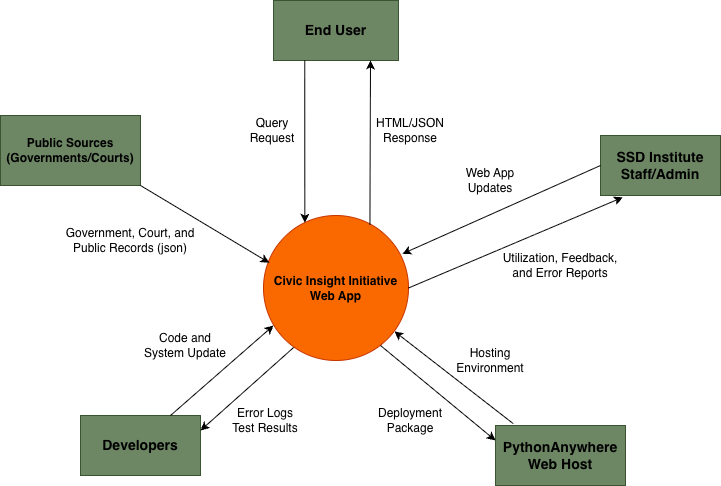

[Back to read me](../../README.md)

# DFD Level 0 — Context Diagram

**Purpose:** Show the entire SSD Institute Web App as one process and its interaction with external entities.

**Please see Legacy DFDs as they were a reference** 

### Entities

- SSD Institute Staff

    - Provide concept content, political suggestions, and updates.

    - Receive feedback and reports on site usage.

- General Public (End Users)

    - View governance concepts and visualizations.

    - Submit questions or feedback (stretch feature).

- GitHub Repository / Hosting (Developers)

    - Stores code, documentation, and updates.

    - Sends deployment updates to the hosted app.

- PythonAnywhere Hosting Service

    - Hosts the live Flask web app and manages SSL/HTTPS.

### Single Process

Process 0: SSD Institute Web Application
Displays governance concepts, civic impacts, and visualizations through a public Flask site.