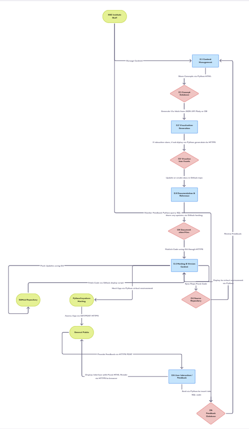

[Back to read me](../../README.md)

# DFD Level 1

**Purpose:** Break down the overall app into major modules.

**Please see Legacy DFDs as they were a reference** 

### Process 0.1 — Content Management

Input : Written concepts, civic impact explanations.

Output : Published pages and updated documentation.

Data Store D1 – Concept Database (markdown or JSON files).

### Process 0.2 — Visualization Generation

Input : Governance data sets, visualization specs.

Output : Static Plotly/D3 charts displayed on pages.

Data Store D2 – Visualization Assets (storage of chart data + images).

### Process 0.3 — Documentation & Reference

Input : Scope, Charter, FAQ, User Stories.

Output : Linked markdown documentation on the site.

Data Store D3 – Documentation Files (repo directory).

### Process 0.4 — Hosting & Version Control

Input : Code commits / updates from developers.

Output : Deployed Flask App on PythonAnywhere.

Data Store D4 – Source Repository (GitHub).

### Process 0.5 — User Interaction / Feedback (Stretch Feature)

Input : Feedback forms / questions from users.

Output : Messages to SSD Institute staff for review.

Data Store D5 – Feedback Database (simple SQLite table).