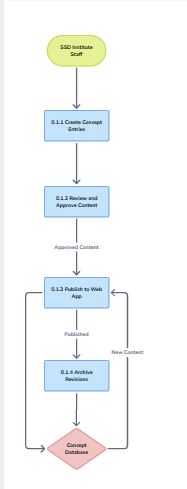
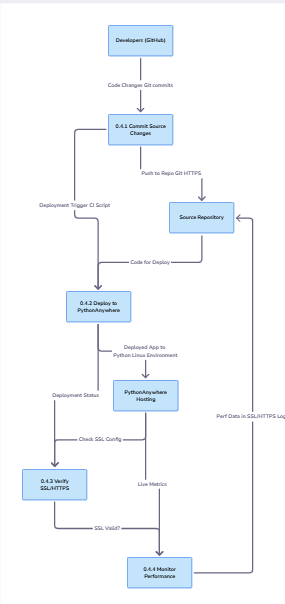
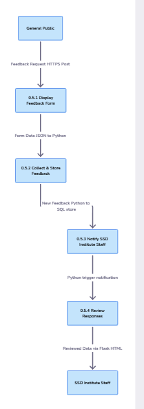

[Back to read me](../../README.md)

# DFD Level 2

**Note: There is no legacy for this DFD**

### Content Managment

**Process 0.1 — Content Management**

- 0.1.1 Create Concept Entries – Staff write 500+ word concept explanations.

- 0.1.2 Review and Approve Content – Internal review before publishing.

- 0.1.3 Publish to Web App – Push Markdown to Flask templates.

- 0.1.4 Archive Revisions – Save old versions for audit.

### Visualizations

**Process 0.2 — Visualization Generation**

- 0.2.1 Load Governance Data – Prepare data for three core visualizations.

- 0.2.2 Generate Plotly Charts – Collaborative Veto, Multi-Choice Voting, Supreme Court Veto.

- 0.2.3 Embed Charts in Templates – Integrate plots within Flask routes.

- 0.2.4 (Stretch) Create D3 Visualization – Minimum Space treemap/cartogram.

### Documentation

**Process 0.3 — Documentation & Reference**

0.3.1 Collect Project Docs – Charter, Scope, FAQ, User Stories.

0.3.2 Convert Markdown to HTML – Static rendering via Flask.

0.3.3 Organize Navigation – Add links to main pages.

0.3.4 Update Version Control – Push updated docs to GitHub.

### Hosting / Github

**Process 0.4 — Hosting & Version Control**

- 0.4.1 Commit Source Changes – Developers push updates to GitHub.

- 0.4.2 Deploy to PythonAnywhere – Pull and run Gunicorn instance.

- 0.4.3 Verify SSL and HTTPS Connections – Confirm secure deployment.

- 0.4.4 Monitor Performance – Check uptime and error logs.

### User Interaction

**Process 0.5 — User Interaction / Feedback**

- 0.5.1 Display Feedback Form – Public contact page.

- 0.5.2 Collect and Store Feedback – Save to Feedback Database.

- 0.5.3 Notify SSD Institute Staff – Trigger email or dashboard alert.

- 0.5.4 Review Responses – Staff read and plan updates