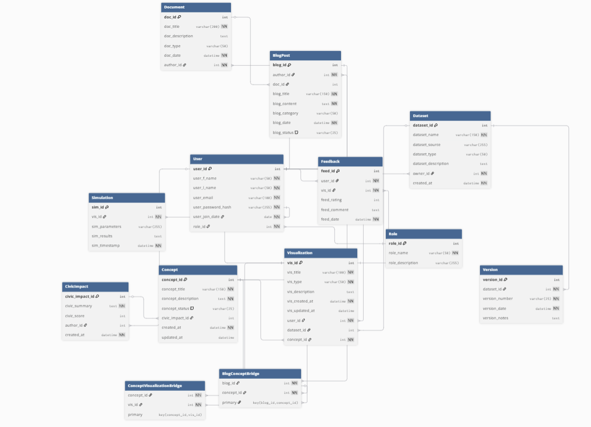
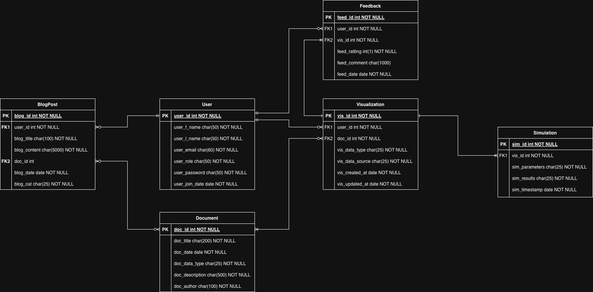

[Back to read me](../../README.md)

# ERD

The Entity-Relationship Diagram (ERD) represents the data architecture for the Flask-based SSD Institute web application. This system is designed to manage users, projects, datasets, and analytical reports within a structured and scalable database model. The diagram captures the logical relationships among entities such as Users, Projects, Datasets, Analyses, Reports, and Feedback, ensuring that each component of the application can interact seamlessly through well-defined relationships and constraints. This is the final at scale ERD considering that the MVP does not include a database. Primary and foreign keys are established to maintain data integrity, while normalization is applied to eliminate redundancy and support efficient querying.

The purpose of this ERD is to provide a blueprint for database implementation and application integration for the final version of the SSD web app. By clearly defining cardinalities and data dependencies, our model ensures that users can create projects, upload datasets, perform analyses, and generate reports with consistent and traceable data flow. The structure supports role-based user access, report generation, and an iterative feedback process, by forming the foundation for a reliable and maintainable backend. This ERD serves as both a development reference and a communication tool, aligning design intent across developers, analysts, and stakeholders for the present and future of the project.

## Legacy ERD

This legacy ERD was the framework to build the new and updated ERD model described above. 