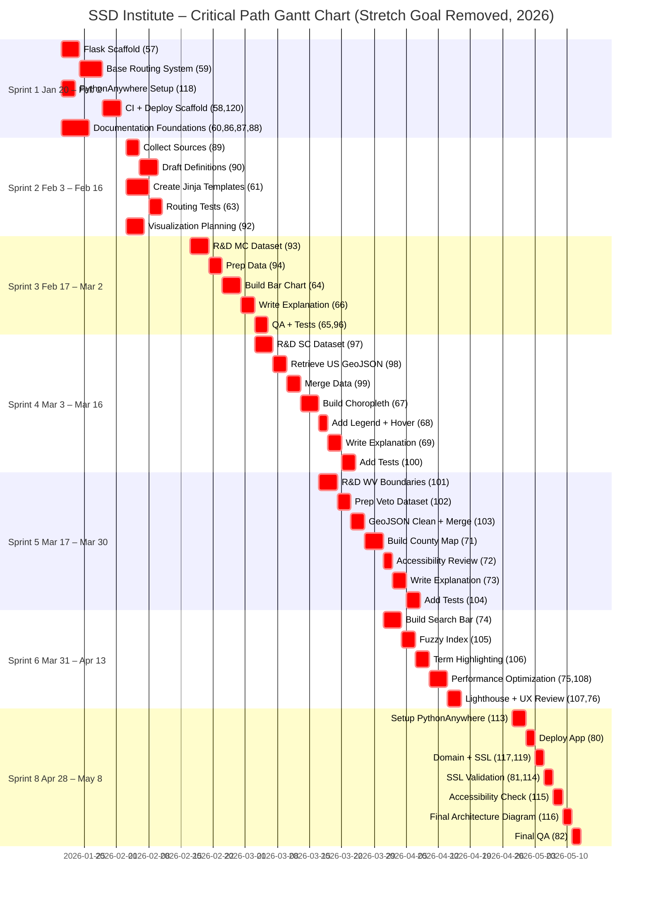
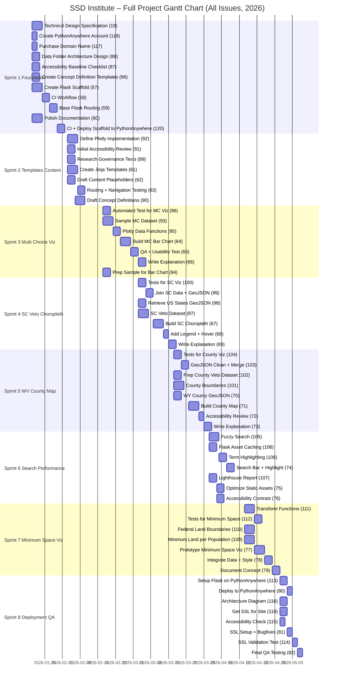
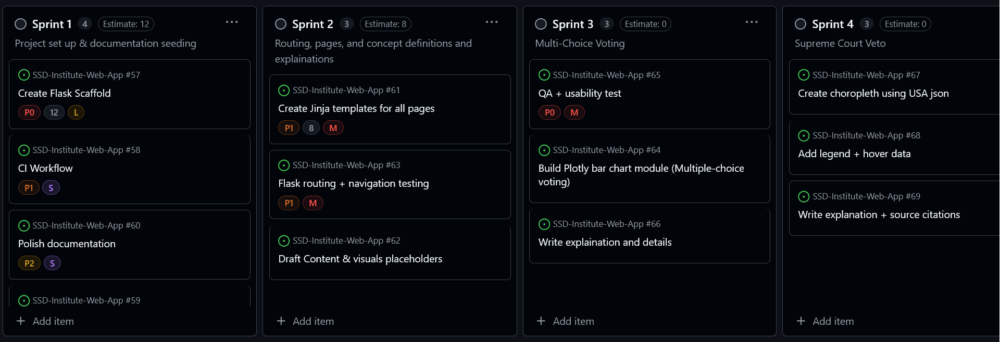
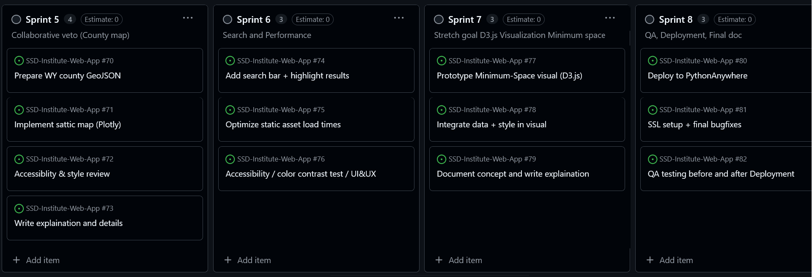

[Back to README.md](../../../README.md)

# Project Plan

This is the basic project plan and links to details for the project plan. 

## WBS

# Work Breakdown Structure (WBS)  
**Level 1 — SSD Web App**

## 1.0 Project Management
- 1.1 Meeting minutes, RACI, updates

## 2.0 Flask Framework
- 2.1 Setup  
- 2.2 Routing  
- 2.3 Templates  

## 3.0 Visualizations
- 3.1 Multi-Choice Voting  
- 3.2 Supreme Court Veto  
- 3.3 Collaborative Veto  
- 3.4 Minimum Space *(stretch goal)*  

## 4.0 Documentation
- 4.1 Concept pages  
- 4.2 Civic impact summaries  
- 4.3 FAQs & help  

## 5.0 Deployment
- 5.1 PythonAnywhere  
- 5.2 SSL/HTTPS  
- 5.3 Testing/QA  

## 6.0 Maintenance
- 6.1 Version control  
- 6.2 Future roadmap  

# Gahntt Chart Image

Please go to SSD-Institute Organization > Projects > SSD Workflow 
and click the "RoadMap", this is if you have contributer access; if you don't 
you can request it from Thommond / Thom on Github. 

Made with Mermaid Markdown syntax based off Github issues. 

## Critical Path view 

## Full Features for this portion 

This does not include admin pages. 

## Github Project at Start

Please see the project board for more details

## PMP Table Information 

#### Notes
- **User story mapping**
  - **US‑1:** Definitions + navigation (Home, content pages)
  - **US‑2:** Multiple‑choice / approval bar chart (MC voting)
  - **US‑3:** Supreme Court Check (SC veto choropleth)
  - **US‑4:** Collaborative / County veto maps (WV / county maps)
  - **US‑5:** HTTPS / site security
  - **US‑6:** Search + highlighting + performance
  - **US‑7:** Documentation clarity and publishing
  - **US‑8:** Deployment, hosting, domain
  - **US‑9:** Minimum Space visualization (stretch)
- **Wireframes** referenced the exact filenames `docs/Founding/ScreenSequenceIMG`.  
- **Milestones** match sprints exactly (Sprint 1…Sprint 8) meaning M1-M8 matches sprints.  

| Sprint | Dates               | PMP Task ID | Task                                   | Milestone  | User Story | Screen/Wireframe                                                                                          | Deliverables                                           | Acceptance criteria                                 |
|--------|---------------------|-------------|----------------------------------------|------------|------------|------------------------------------------------------------------------------------------------------------|--------------------------------------------------------|-------------------------------------------------------------|
| 1      | Jan 20–Feb 2, 2026  | 19          | Technical Design Specification         | Sprint 1   | US‑7       | N/A                                                                                                        | Design spec                                            | Spec approved; no major gaps                                 |
| 1      | Jan 20–Feb 2, 2026  | 118         | Create PythonAnywhere Account          | Sprint 1   | US‑8       | N/A                                                                                                        | Host account created                                   | Account active; login verified                               |
| 1      | Jan 20–Feb 2, 2026  | 117         | Purchase Domain Name                   | Sprint 1   | US‑8       | N/A                                                                                                        | Domain purchased                                       | Domain resolves; ownership confirmed                         |
| 1      | Jan 20–Feb 2, 2026  | 88          | Data Folder Architecture Design        | Sprint 1   | US‑7       | N/A                                                                                                        | Data folder structure                                  | Folders created; consistent naming                           |
| 1      | Jan 20–Feb 2, 2026  | 87          | Accessibility Baseline Checklist       | Sprint 1   | US‑5       | [MobileLandingPage.png](../../docs/Founding/ScreenSequenceIMG/MobileLandingPage.png)                       | Baseline checklist                                     | Checklist completed; issues logged                           |
| 1      | Jan 20–Feb 2, 2026  | 86          | Concept Definition Templates           | Sprint 1   | US‑7       | [DesktopLandingPage.png](../../docs/Founding/ScreenSequenceIMG/DesktopLandingPage.png)                     | Template files                                         | Templates render without errors                              |
| 1      | Jan 20–Feb 2, 2026  | 57          | Create Flask Scaffold                  | Sprint 1   | US‑8       | N/A                                                                                                        | Flask app scaffold                                     | App runs locally                                             |
| 1      | Jan 20–Feb 2, 2026  | 58          | CI Workflow                            | Sprint 1   | US‑8       | N/A                                                                                                        | CI pipeline                                            | CI passes on push                                            |
| 1      | Jan 20–Feb 2, 2026  | 59          | Base Flask Routing                     | Sprint 1   | US‑1       | [MobileLandingPage.png](../../docs/Founding/ScreenSequenceIMG/MobileLandingPage.png)                       | Base routes                                            | Routes return 200                                            |
| 1      | Jan 20–Feb 2, 2026  | 60          | Polish Documentation                   | Sprint 1   | US‑7       | [DesktopLandingPage.png](../../docs/Founding/ScreenSequenceIMG/DesktopLandingPage.png)                     | Project docs                                           | Docs updated; links work                                     |
| 1      | Jan 20–Feb 2, 2026  | 120         | CI + Deploy Scaffold to PythonAnywhere | Sprint 1   | US‑8       | N/A                                                                                                        | Deployment job                                         | App deploys to host                                          |
| 2      | Feb 3–Feb 16, 2026  | 92          | Define Plotly Implementation           | Sprint 2   | US‑2       | [MultipleChoiceVotingDesktopPage.png](../../docs/Founding/ScreenSequenceIMG/MultipleChoiceVotingDesktopPage.png) | Plotly plan + prototype                                | Prototype renders a sample chart                             |
| 2      | Feb 3–Feb 16, 2026  | 91          | Initial Accessibility Review           | Sprint 2   | US‑1       | [MobileLandingPage.png](../../docs/Founding/ScreenSequenceIMG/MobileLandingPage.png)                       | A11y review report                                     | Key issues listed; basic fixes begun                         |
| 2      | Feb 3–Feb 16, 2026  | 89          | Research Governance Texts              | Sprint 2   | US‑1       | [DesktopLandingPage.png](../../docs/Founding/ScreenSequenceIMG/DesktopLandingPage.png)                     | Source list                                            | Sources cited; accessible formats                            |
| 2      | Feb 3–Feb 16, 2026  | 61          | Create Jinja Templates                 | Sprint 2   | US‑1       | [MobileMenuPage.png](../../docs/Founding/ScreenSequenceIMG/MobileMenuPage.png)                             | Templates for pages                                    | Pages render; layout stable                                  |
| 2      | Feb 3–Feb 16, 2026  | 62          | Draft Content Placeholders             | Sprint 2   | US‑1       | [DesktopMenuViewPage.png](../../docs/Founding/ScreenSequenceIMG/DesktopMenuViewPage.png)                   | Draft content + placeholders                           | Content visible; links present                               |
| 2      | Feb 3–Feb 16, 2026  | 63          | Routing + Navigation Testing           | Sprint 2   | US‑1       | [DesktopMenuViewPage.png](../../docs/Founding/ScreenSequenceIMG/DesktopMenuViewPage.png)                   | Navigation test suite                                  | All nav paths work                                           |
| 2      | Feb 3–Feb 16, 2026  | 90          | Draft Concept Definitions              | Sprint 2   | US‑1       | [DesktopLandingPage.png](../../docs/Founding/ScreenSequenceIMG/DesktopLandingPage.png)                     | Draft definitions                                      | Word count met; clarity passes                               |
| 3      | Feb 17–Mar 2, 2026  | 96          | Automated Test for MC Viz              | Sprint 3   | US‑2       | [MultipleChoiceVotingDesktopPage.png](../../docs/Founding/ScreenSequenceIMG/MultipleChoiceVotingDesktopPage.png) | Test suite for MC viz                                  | Tests green for viz                                          |
| 3      | Feb 17–Mar 2, 2026  | 93          | Sample MC Dataset                      | Sprint 3   | US‑2       | [MultipleChoiceVotingDesktopPage.png](../../docs/Founding/ScreenSequenceIMG/MultipleChoiceVotingDesktopPage.png) | Sample dataset                                         | Dataset loads; basic stats OK                                |
| 3      | Feb 17–Mar 2, 2026  | 95          | Plotly Data Functions                  | Sprint 3   | US‑2       | [MultipleChoiceVotingDesktopPage.png](../../docs/Founding/ScreenSequenceIMG/MultipleChoiceVotingDesktopPage.png) | Data transform functions                               | Functions return expected output                             |
| 3      | Feb 17–Mar 2, 2026  | 64          | Build MC Bar Chart                     | Sprint 3   | US‑2       | [MultipleChoiceVotingDesktopPage.png](../../docs/Founding/ScreenSequenceIMG/MultipleChoiceVotingDesktopPage.png) | Bar chart                                              | Chart renders; labels clear; loads < 3s                      |
| 3      | Feb 17–Mar 2, 2026  | 65          | QA + Usability Test                    | Sprint 3   | US‑2       | [MultipleChoiceVotingDesktopPage.png](../../docs/Founding/ScreenSequenceIMG/MultipleChoiceVotingDesktopPage.png) | QA checklist + findings                                | No blocking issues                                           |
| 3      | Feb 17–Mar 2, 2026  | 66          | Write Explanation                      | Sprint 3   | US‑2       | [MultipleChoiceVotingDesktopPage.png](../../docs/Founding/ScreenSequenceIMG/MultipleChoiceVotingDesktopPage.png) | Explanation text                                       | Text published; links valid                                  |
| 3      | Feb 17–Mar 2, 2026  | 94          | Prep Sample for Bar Chart              | Sprint 3   | US‑2       | [MultipleChoiceVotingDesktopPage.png](../../docs/Founding/ScreenSequenceIMG/MultipleChoiceVotingDesktopPage.png) | Prepared sample data                                   | Data formatted for chart                                     |
| 4      | Mar 3–Mar 16, 2026  | 100         | Tests for SC Viz                       | Sprint 4   | US‑3       | [SupremeCourtCheckDesktop.png](../../docs/Founding/ScreenSequenceIMG/SupremeCourtCheckDesktop.png)           | Test suite                                             | Tests green                                                  |
| 4      | Mar 3–Mar 16, 2026  | 99          | Join SC Data + GeoJSON                 | Sprint 4   | US‑3       | [SupremeCourtCheckDesktop.png](../../docs/Founding/ScreenSequenceIMG/SupremeCourtCheckDesktop.png)           | Merged dataset                                         | Merge complete; spot check OK                                |
| 4      | Mar 3–Mar 16, 2026  | 98          | Retrieve US States GeoJSON             | Sprint 4   | US‑3       | [SupremeCourtCheckMobile.png](../../docs/Founding/ScreenSequenceIMG/SupremeCourtCheckMobile.png)             | GeoJSON acquired                                       | File loads; schema valid                                     |
| 4      | Mar 3–Mar 16, 2026  | 97          | SC Veto Dataset                        | Sprint 4   | US‑3       | [SupremeCourtCheckDesktop.png](../../docs/Founding/ScreenSequenceIMG/SupremeCourtCheckDesktop.png)           | Dataset R&D                                            | Fields defined; sample ready                                 |
| 4      | Mar 3–Mar 16, 2026  | 67          | Build SC Choropleth                    | Sprint 4   | US‑3       | [SupremeCourtCheckDesktop.png](../../docs/Founding/ScreenSequenceIMG/SupremeCourtCheckDesktop.png)           | Choropleth map                                         | Map renders; colors correct                                  |
| 4      | Mar 3–Mar 16, 2026  | 68          | Add Legend + Hover                     | Sprint 4   | US‑3       | [SupremeCourtCheckDesktop.png](../../docs/Founding/ScreenSequenceIMG/SupremeCourtCheckDesktop.png)           | Legend + hover interactivity                           | Legend readable; hover shows exact counts                    |
| 4      | Mar 3–Mar 16, 2026  | 69          | Write Explanation + Citations          | Sprint 4   | US‑3       | [SupremeCourtCheckDesktop.png](../../docs/Founding/ScreenSequenceIMG/SupremeCourtCheckDesktop.png)           | Explanation + citations                                | Text published; citations present                            |
| 5      | Mar 17–Mar 30, 2026 | 104         | Tests for County Viz                   | Sprint 5   | US‑4       | [CollaberativeVetoDeskopPage.png](../../docs/Founding/ScreenSequenceIMG/CollaberativeVetoDeskopPage.png)     | Test suite                                             | Tests green                                                  |
| 5      | Mar 17–Mar 30, 2026 | 103         | GeoJSON Clean + Merge                  | Sprint 5   | US‑4       | [CollaberativeVetoDeskopPage.png](../../docs/Founding/ScreenSequenceIMG/CollaberativeVetoDeskopPage.png)     | Cleaned + merged GeoJSON                               | Valid GeoJSON; no errors                                     |
| 5      | Mar 17–Mar 30, 2026 | 102         | Prep County Veto Dataset               | Sprint 5   | US‑4       | [CollaberativeVetoMobilePage.png](../../docs/Founding/ScreenSequenceIMG/CollaberativeVetoMobilePage.png)     | Prepared dataset                                       | Dataset fields complete                                      |
| 5      | Mar 17–Mar 30, 2026 | 101         | County Boundaries                      | Sprint 5   | US‑4       | [CollaberativeVetoDeskopPage.png](../../docs/Founding/ScreenSequenceIMG/CollaberativeVetoDeskopPage.png)     | Boundary research                                      | Counties verified                                            |
| 5      | Mar 17–Mar 30, 2026 | 70          | WY County GeoJSON                      | Sprint 5   | US‑4       | [CollaberativeVetoMobilePage.png](../../docs/Founding/ScreenSequenceIMG/CollaberativeVetoMobilePage.png)     | WY County GeoJSON                                      | File loads; counties match                                   |
| 5      | Mar 17–Mar 30, 2026 | 71          | Build County Map                       | Sprint 5   | US‑4       | [CollaberativeVetoDeskopPage.png](../../docs/Founding/ScreenSequenceIMG/CollaberativeVetoDeskopPage.png)     | County map                                             | Map renders without errors                                   |
| 5      | Mar 17–Mar 30, 2026 | 72          | Accessibility + Style Review           | Sprint 5   | US‑4       | [CollaberativeVetoMobilePage.png](../../docs/Founding/ScreenSequenceIMG/CollaberativeVetoMobilePage.png)     | Review checklist                                       | Issues logged; critical fixed                                |
| 5      | Mar 17–Mar 30, 2026 | 73          | Write Explanation + Details            | Sprint 5   | US‑4       | [CollaberativeVetoDeskopPage.png](../../docs/Founding/ScreenSequenceIMG/CollaberativeVetoDeskopPage.png)     | Explanation                                            | Text published                                               |
| 6      | Mar 31–Apr 13, 2026 | 105         | Implement Fuzzy Search                 | Sprint 6   | US‑6       | [SearchDesktop.png](../../docs/Founding/ScreenSequenceIMG/SearchDesktop.png)                                  | Fuzzy search                                           | Finds close matches                                          |
| 6      | Mar 31–Apr 13, 2026 | 108         | Flask Asset Caching                    | Sprint 6   | US‑6       | [SearchDesktop.png](../../docs/Founding/ScreenSequenceIMG/SearchDesktop.png)                                  | Caching approach                                       | Assets cached; load faster                                   |
| 6      | Mar 31–Apr 13, 2026 | 106         | Implement Term Highlighting            | Sprint 6   | US‑6       | [SearchDesktop.png](../../docs/Founding/ScreenSequenceIMG/SearchDesktop.png)                                  | Term highlighting                                      | Highlights correct terms                                     |
| 6      | Mar 31–Apr 13, 2026 | 74          | Search Bar + Highlight                 | Sprint 6   | US‑6       | [SearchDesktop.png](../../docs/Founding/ScreenSequenceIMG/SearchDesktop.png)                                  | Search UI                                              | Search executes; no errors                                   |
| 6      | Mar 31–Apr 13, 2026 | 107         | Lighthouse Report                      | Sprint 6   | US‑6       | [SearchDesktop.png](../../docs/Founding/ScreenSequenceIMG/SearchDesktop.png)                                  | Lighthouse results                                     | Performance ≥ target threshold                               |
| 6      | Mar 31–Apr 13, 2026 | 75          | Optimize Static Assets                 | Sprint 6   | US‑6       | [SearchDesktop.png](../../docs/Founding/ScreenSequenceIMG/SearchDesktop.png)                                  | Optimized assets                                       | Reduced bundle size                                          |
| 6      | Mar 31–Apr 13, 2026 | 76          | Accessibility + Color Contrast         | Sprint 6   | US‑6       | [SearchDesktop.png](../../docs/Founding/ScreenSequenceIMG/SearchDesktop.png)                                  | Contrast adjustments                                   | Passes contrast checks                                       |
| 7      | Apr 14–Apr 27, 2026 | 111         | Transform Functions                    | Sprint 7   | US‑9       | [MinimumAmountOfSpacePage.png](../../docs/Founding/ScreenSequenceIMG/MinimumAmountOfSpacePage.png)           | Transform utilities                                    | Functions run; sample output OK                              |
| 7      | Apr 14–Apr 27, 2026 | 112         | Tests for Minimum Space                | Sprint 7   | US‑9       | [MinimumAmountOfSpacePage.png](../../docs/Founding/ScreenSequenceIMG/MinimumAmountOfSpacePage.png)           | Test suite                                             | Tests green                                                  |
| 7      | Apr 14–Apr 27, 2026 | 110         | Federal Land Boundaries                | Sprint 7   | US‑9       | [MinimumAmountOfSpaceDesktop.png](../../docs/Founding/ScreenSequenceIMG/MinimumAmountOfSpaceDesktop.png)     | Boundary dataset                                       | Dataset loads; fields defined                                |
| 7      | Apr 14–Apr 27, 2026 | 109         | Minimum Land per Population            | Sprint 7   | US‑9       | [MinimumAmountOfSpaceDesktop.png](../../docs/Founding/ScreenSequenceIMG/MinimumAmountOfSpaceDesktop.png)     | Metric approach                                        | Formula agreed; sample calc OK                               |
| 7      | Apr 14–Apr 27, 2026 | 77          | Prototype Minimum Space Viz            | Sprint 7   | US‑9       | [MinimumAmountOfSpaceDesktop.png](../../docs/Founding/ScreenSequenceIMG/MinimumAmountOfSpaceDesktop.png)     | Prototype visualization                                 | Renders; basic interactivity works                           |
| 7      | Apr 14–Apr 27, 2026 | 78          | Integrate Data + Style                 | Sprint 7   | US‑9       | [MinimumAmountOfSpaceDesktop.png](../../docs/Founding/ScreenSequenceIMG/MinimumAmountOfSpaceDesktop.png)     | Integrated viz                                         | Styles consistent; data linked                                |
| 7      | Apr 14–Apr 27, 2026 | 79          | Document Concept                       | Sprint 7   | US‑9       | [MinimumAmountOfSpaceDesktop.png](../../docs/Founding/ScreenSequenceIMG/MinimumAmountOfSpaceDesktop.png)     | Concept doc                                            | Published; readable                                           |
| 8      | Apr 28–May 8, 2026  | 113         | Setup Flask on PythonAnywhere          | Sprint 8   | US‑8       | [ContactUsDesktopPage.png](../../docs/Founding/ScreenSequenceIMG/ContactUsDesktopPage.png)                 | Hosted Flask app                                      | App reachable on domain                                       |
| 8      | Apr 28–May 8, 2026  | 80          | Deploy to PythonAnywhere               | Sprint 8   | US‑8       | [ContactUsDesktopPage.png](../../docs/Founding/ScreenSequenceIMG/ContactUsDesktopPage.png)                 | Deployment script                                     | Deploy runs cleanly                                           |
| 8      | Apr 28–May 8, 2026  | 116         | Architecture Diagram                   | Sprint 8   | US‑7       | [ContactUsDesktopPage.png](../../docs/Founding/ScreenSequenceIMG/ContactUsDesktopPage.png)                 | Architecture diagram                                   | Diagram published; components clear                            |
| 8      | Apr 28–May 8, 2026  | 119         | Get SSL for Site                       | Sprint 8   | US‑5       | [ContactUsMobilePage.png](../../docs/Founding/ScreenSequenceIMG/ContactUsMobilePage.png)                   | SSL certificate                                        | Issued; valid dates                                            |
| 8      | Apr 28–May 8, 2026  | 115         | Accessibility Check                    | Sprint 8   | US‑7       | [ContactUsMobilePage.png](../../docs/Founding/ScreenSequenceIMG/ContactUsMobilePage.png)                   | Accessibility report                                   | No critical issues                                             |
| 8      | Apr 28–May 8, 2026  | 81          | SSL Setup + Bugfixes                   | Sprint 8   | US‑5       | [ContactUsMobilePage.png](../../docs/Founding/ScreenSequenceIMG/ContactUsMobilePage.png)                   | SSL configuration                                     | HTTPS works; no mixed content                                  |
| 8      | Apr 28–May 8, 2026  | 114         | HTTPS/SSL Validation Test              | Sprint 8   | US‑5       | [ContactUsMobilePage.png](../../docs/Founding/ScreenSequenceIMG/ContactUsMobilePage.png)                   | Validation test suite                                  | Tests green; cert chain valid                                  |
| 8      | Apr 28–May 8, 2026  | 82          | Final QA Testing                       | Sprint 8   | US‑7       | [ContactUsDesktopPage.png](../../docs/Founding/ScreenSequenceIMG/ContactUsDesktopPage.png)                 | QA sign‑off                                            | No P1 issues; sign‑off recorded                                |

